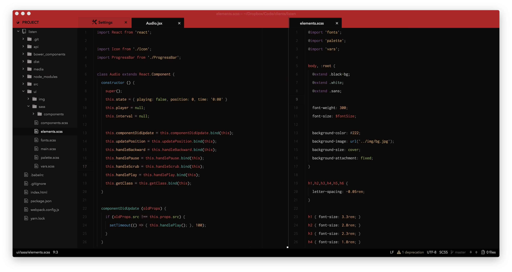

# Killer Synax

**Killer Syntax** theme, by Austin Billings. Made for use with the [Killer UI](https://github.com/austinbillings/killer-ui) theme.

## Optimal Fonts
The fonts you use are of course completely up to you, but **Killer** was designed with the following primary typefaces in mind:

- [**Killer UI**](https://github.com/austinbillings/killer-ui): Avenir Next
- Killer Syntax: Inconsolata (with Menlo a close second), with editor line-height set to **2.0**.

